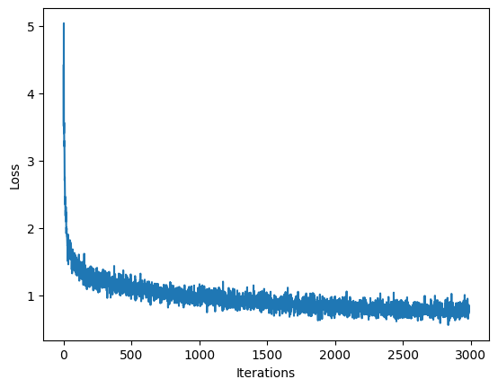

# Music Generation with an LSTM (PyTorch)

A character-level LSTM that learns Irish folk music from text and writes new songs.

The model reads songs written in [ABC notation](https://abcnotation.com/), a text format for sheet music, and learns to predict the next character. Once trained, it generates new ABC text one character at a time, which is then turned into audio.

## 🎵 Listen

Generated by the model. None of these tunes are in the training data.

| Song | Length |
|---|---|
| [song_1.wav](samples/song_1.wav) | 1:30 |
| [song_2.wav](samples/song_2.wav) | 0:29 |
| [song_3.wav](samples/song_3.wav) | 0:21 |

Open a file and click **View raw** / download to play it.

A snippet of the ABC text the model wrote (the tune title is made up by the model too):

```
X:278
T:Killy Glennn's
Z: id:dc-jig-158
M:6/8
L:1/8
K:G Major
D2|Bee2 Bee2|d2d^c d3B|A2dc d2ef|g2e^p f2:|!
a|baf g3|fgf edc|B2c def|g2g gfg|!
```

## How it works

```
ABC text ─► character → integer ─► Embedding(83, 256) ─► LSTM(1024) ─► Linear(83) ─► next character
```

1. **Data:** 817 Irish folk songs in ABC notation, 83 unique characters.
2. **Vectorize:** map each character to an integer.
3. **Train:** feed 100-character sequences; the target is the same sequence shifted by one character. Loss is cross-entropy over the vocabulary.
4. **Generate:** start from a seed character, sample the next character from the model's predicted distribution, feed it back in, and repeat for 1,000 steps.
5. **Synthesize:** extract valid songs from the generated text and convert them to audio.

## Training

| Hyperparameter | Value |
|---|---|
| Iterations | 3,000 |
| Batch size | 8 |
| Sequence length | 100 |
| Learning rate | 5e-3 (Adam) |
| Embedding dim | 256 |
| LSTM hidden size | 1,024 |

Trained on a Colab T4 GPU in about 1.5 minutes. Loss dropped from **4.41** (random guessing) to **0.85**.



## Run it

Open [`music_generation.ipynb`](music_generation.ipynb) in Google Colab, set **Runtime → Change runtime type → T4 GPU**, and run all cells.

## Stack

Python · PyTorch · NumPy · Google Colab

## Credit

Built as part of [MIT 6.S191: Introduction to Deep Learning](http://introtodeeplearning.com/), Lab 1 (Part 2). The dataset, song-to-audio utilities (`mitdeeplearning` package) and notebook scaffold come from the course; the data pipeline, model, training loop and generation code are my implementations of the lab exercises.
